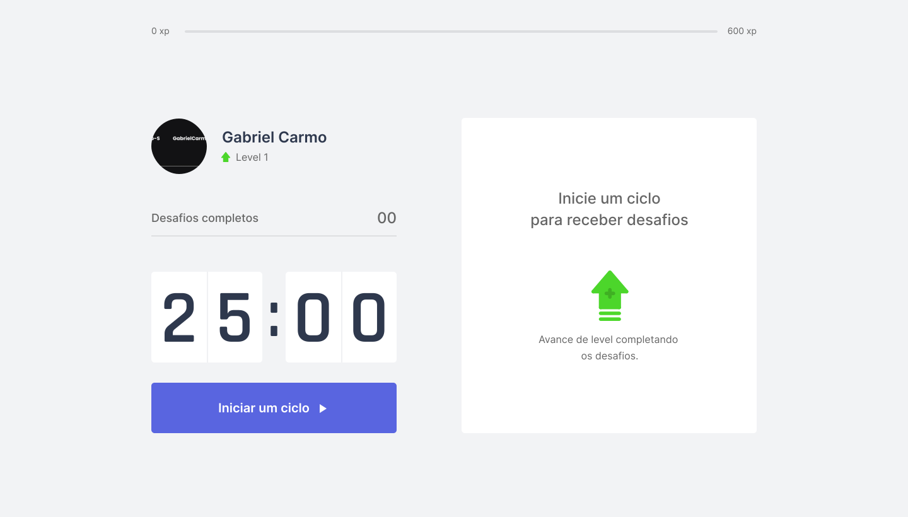

<h1 align="center">
    
    <br>Next Level Week #4<br/>
    NEXT.JS
</h1>

<p align="center">
  <a href="#bookmark-sobre">Sobre</a>&nbsp;&nbsp;&nbsp;|&nbsp;&nbsp;&nbsp;
  <a href="#rocket-tecnologias">Tecnologias</a>&nbsp;&nbsp;&nbsp;|&nbsp;&nbsp;&nbsp;
  <a href="#boom-como-executar">Como Executar</a>&nbsp;&nbsp;&nbsp;|&nbsp;&nbsp;&nbsp;
  <a href="#memo-licença">Licença</a>
</p>

<p align="center">
  
<p>

## :bookmark: Sobre

O Move.it é um App 

O **Move.it** é uma aplicação Web que utiliza a técnica de pomodoro, com o objetivo de melhorar sua produtividade e foco. Desenvolvido durante a Next Level Week #4 da Rocketseat.

<hr />

<a href="https://move-it-seven-xi.vercel.app/" align="center">Para testar a aplicação</a>
## :rocket: Tecnologias

-  [Typescript](https://www.typescriptlang.org/)
-  [ReactJS](https://reactjs.org/)
-  [NextJS](https://nextjs.org/)

## :boom: Como Executar

- ### **Pré-requisitos**

  - É **necessário** possuir o **[Node.js](https://nodejs.org/en/)** instalado no computador
  - É **necessário** possuir o **[Git](https://git-scm.com/)** instalado e configurado no computador
  - Também, é **preciso** ter um gerenciador de pacotes seja o **[NPM](https://www.npmjs.com/)** ou **[Yarn](https://yarnpkg.com/)**.

1. Faça um clone do repositório:

```sh
  $ git clone https://github.com/GabrielCarmo-S/Move-It.git
```

2. Executando a Aplicação:

```sh
  # Aplicação
  $ cd move-it
  # Instalando as dependências do projeto.
  $ yarn # ou npm install
  # Inicie a aplicação 
  $ yarn dev # ou npm start
```

## :memo: Licença

Esse projeto está sob a licença MIT. Veja o arquivo [LICENSE](LICENSE.md) para mais detalhes.

---
<sup>Projeto desenvolvido com a tutoria de [Diego Fernandes](https://github.com/diego3g), da [Rocketseat](rocketseat.com.br).</sup>
 